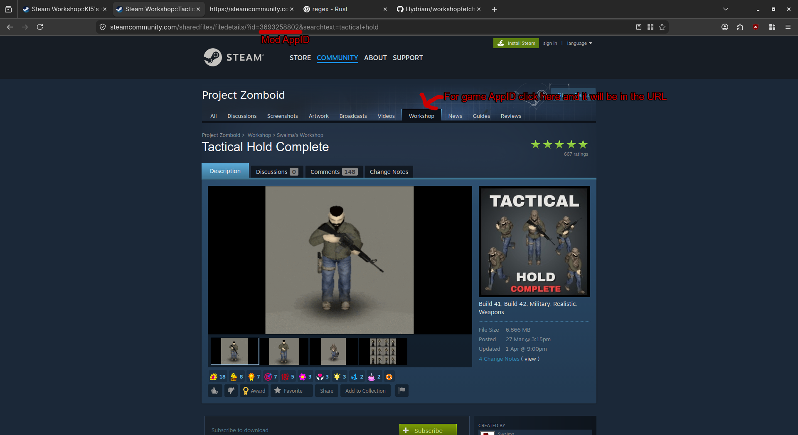
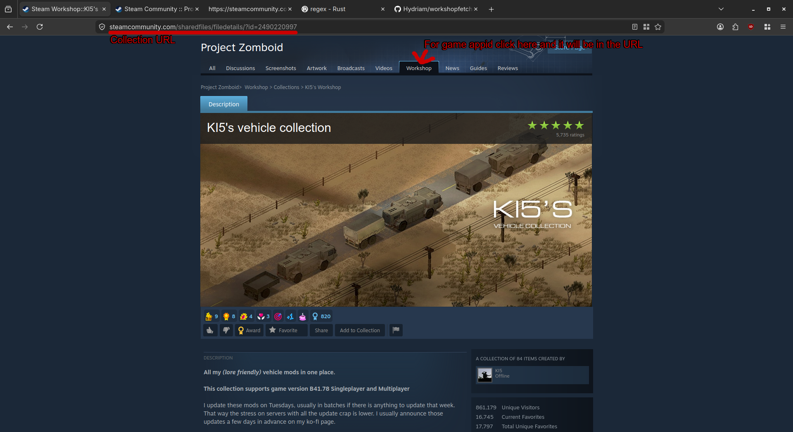

# Workshopfetcher-rs
A linux cli app for downloading mods from steam workshop

**The app is still work-in-progress**
## What this does?
This app can download mods from steam workshop using steamcmd without owning the game on steam, its uselful if you have a game on gog which modding community is on steam workshop like rimworld or project zomboid.

**You need 32 bit version of glibc installed beacuse steamcmd needs it**
## Usage
### Reset
It basically removes and then downloads steamcmd, run it if you encounter any issues with steamcmd.
Reset will also remove downloaded mods if they arent moved to desired directory.
### Download Mods
It downloads specifed mods, to find the mod and game appid refer to this image:

So for this mod the full command would be
```
cargo run download mods --game-id 108600 --mod-ids 3693258802
```
In --mod-ids you can put multiple mods
### Download Collection
It downloads specifed collection, to find the collection and game appid refer to this image:

So for this collection the full command would be
```
cargo run download collection --game-id 108600 --collection-url https://steamcommunity.com/sharedfiles/filedetails/?id=2490220997
```
## Building
To run:
```
git clone https://github.com/Hydriam/workshopfetcher-rs
cd workshopfetcher-rs
cargo run
```
## AI Usage
The only thing created with AI is the regex which extracts mod links from collection source page.
